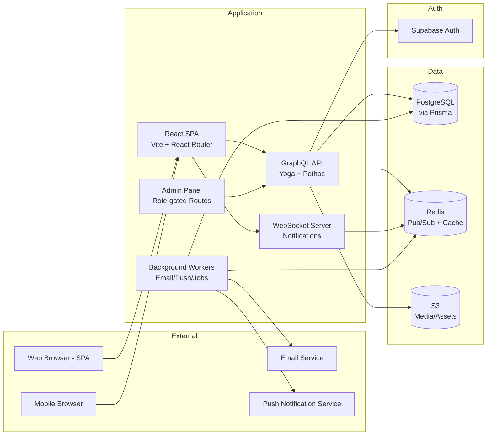
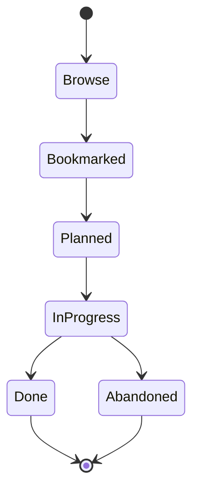
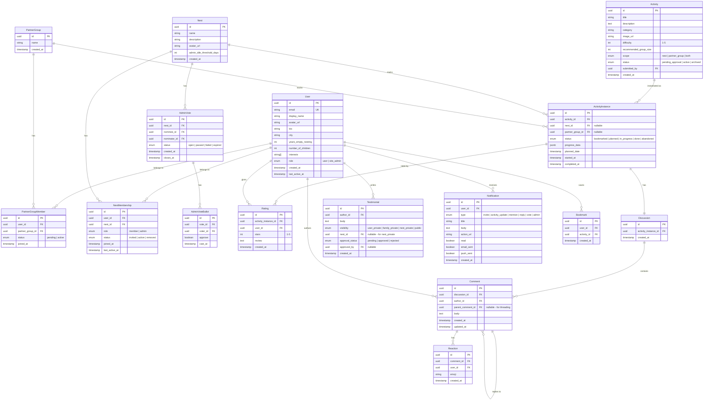

# Empty Nesters Club — Implementation Plan

**Created:** 2026-06-14
**Status:** Draft

---

## 1. Vision

The Empty Nesters Club is a social platform for couples and partner groups whose children have left home. It provides a structured, gamified community experience where users form "nests" (groups), discover and track shared activities, earn badges, and rediscover their relationships through fun, social engagement. The platform emphasizes whimsy, warmth, and community — treating the transition to empty-nesting as an adventure rather than a loss.

---

## 2. Core Architecture

### Key Architectural Decisions

| Decision | Rationale |
|----------|-----------|
| API-first (separate SPA + API) | Future mobile apps consume the same API |
| GraphQL over REST | Complex relational data (nests, partners, activities, threads); flexible frontend querying |
| Supabase Auth | Simple email auth with room to add social providers; JWT-based, stateless verification |
| WebSocket for real-time | In-app notifications, discussion updates; Redis pub/sub for horizontal scaling |
| Background workers | Email delivery, push notifications, idle-admin detection, vote tallying |

---

## 3. Feature Requirements

### 3.1 Authentication & Onboarding

- Email-based signup via Supabase Auth (email + password, magic link option)
- Email verification required before full access
- Onboarding flow: basic profile creation → optional nest creation → invite partners
- JWT tokens for API authentication
- Session management with refresh tokens

### 3.2 User Profiles

- Display name, avatar (upload to S3), bio
- Extended context: years as empty nester, number of children, city/region
- Interests/hobbies tags
- Partner link(s) — visible on profile
- Nest memberships listed
- Privacy controls: what's visible to public vs nest vs partners
- Testimonials section (private, family, nest, or public)

### 3.3 Partner Groups

- Users can link to one or more partners (accommodates divorced/blended families)
- Partner linking via invite (email-based)
- Partner groups are a first-class entity for activity tracking
- A partner group can belong to multiple nests

### 3.4 Nests (Groups)

- Create a nest with a name, description, optional avatar
- Invite members via email
- Practical max: 100 partner groups per nest
- Users can belong to multiple nests
- Roles: Member, Admin
- Admin capabilities: accept/reject join requests, remove members, manage nest settings
- **Admin succession:** If an admin is idle for a configurable period (default: 30 days), any member can nominate a new admin. A majority vote among active members promotes the nominee.

### 3.5 Activity Catalog

- System-defined activities seeded at launch (~15-20)
- Users can submit new activities for site-admin approval
- Each activity has: title, whimsical description, category, difficulty estimate, group-size recommendation, image
- Activities are browsable with filtering/search
- Categories TBD (e.g., Sports, Social, Adventure, Creative, Food & Drink)

### 3.6 Activity Lifecycle

- **Browse:** User discovers activity in catalog
- **Bookmarked:** Saved for later consideration
- **Planned:** Scheduled with dates, assigned to nest or partner group
- **In Progress:** Actively being worked on, progress tracked
- **Done:** Completed successfully — triggers rating prompt
- **Abandoned:** Stopped before completion — triggers rating prompt (why abandoned)

### 3.7 Activity Tracking (Hybrid)

- **Nest-level activities:** The entire nest participates (e.g., camping trip). One instance, shared progress.
- **Partner-group-level activities:** Individual partner groups track independently (e.g., date night). Nest dashboard aggregates.
- Progress indicators configurable per activity type (checklist, percentage, milestone-based)

### 3.8 Ratings

- 1-5 star rating on completed or abandoned activities
- Optional text review
- Ratings visible at nest level (aggregated) and individual level
- Ratings influence activity recommendations (future feature)

### 3.9 Discussion Boards (Threaded)

- Every activity instance (planned, in-progress, done, abandoned) has a discussion board
- Threaded replies (one level of nesting)
- Reactions (emoji-based, lightweight)
- @mentions for nest members
- Real-time updates via WebSocket

### 3.10 Dashboards

- **User dashboard:** Personal activity history, badges, bookmarks, upcoming planned activities
- **Nest dashboard:** Aggregate view of all nest activities, leaderboard, recent discussions, member activity
- **Partner-group dashboard:** Shared view between partners of their joint activities

### 3.11 Testimonials

- Users write testimonials on their profile
- Visibility levels: User Private, Family Private (partners only), Nest Private, Public
- Public testimonials require site-admin approval
- Nest-private testimonials require nest-admin approval
- Approved public testimonials appear in a site-wide Testimonials section

### 3.12 Notifications (Full Stack)

- **In-app:** Notification bell with unread count, dropdown panel, mark-as-read
- **Email:** Configurable digests (immediate, daily, weekly) for key events
- **Push:** Browser push notifications for mobile-web and desktop
- Events: nest invites, activity updates, discussion replies, @mentions, vote requests, admin actions

### 3.13 Admin Panel (Site Admin)

- Role-gated routes within the same SPA
- Approve/reject user-submitted activities
- Approve/reject public testimonials
- User management (ban, suspend, role changes)
- System metrics dashboard (user counts, active nests, popular activities)
- Content moderation queue

### 3.14 Landing Page

- Whimsical cartoon hero graphic (placeholder initially)
- Prose description of the empty-nester transition (placeholder copy)
- Call-to-action: Sign up
- Public testimonials carousel
- Activity highlights

---

## 4. Data Model (Conceptual)

---

## 5. Technology Stack

| Layer | Technology | Role |
|-------|-----------|------|
| Monorepo | Turborepo + pnpm workspaces | Build orchestration, dependency management |
| Frontend | React 19 + Vite + React Router | SPA with client-side routing |
| UI Components | TBD (Radix UI / Shadcn likely) | Accessible component primitives |
| Styling | TBD (Tailwind CSS likely) | Utility-first CSS |
| GraphQL Client | urql or Apollo Client | Frontend GraphQL operations |
| API Server | Node.js + GraphQL Yoga | GraphQL endpoint |
| Schema Builder | Pothos | Type-safe GraphQL schema from TypeScript |
| ORM | Prisma | Database access, migrations, type generation |
| Database | PostgreSQL 16 | Primary data store |
| Cache / Pub-Sub | Redis | WebSocket scaling, caching, job queues |
| Auth | Supabase Auth | Email auth, JWT verification |
| Real-time | WebSocket (ws / Socket.io) | In-app notifications, live updates |
| Background Jobs | BullMQ (Redis-backed) | Email, push, scheduled tasks (idle detection) |
| Email | TBD (Resend / SES) | Transactional email delivery |
| Push | Web Push API | Browser push notifications |
| File Storage | AWS S3 | Avatars, activity images |
| Containerization | Docker + Docker Compose | Local dev environment |
| CI/CD | GitHub Actions | Lint, test, build, deploy |
| Hosting | AWS ECS/Fargate | Application containers |
| Database (Prod) | AWS RDS (PostgreSQL) | HA, geo-redundant production DB |
| Testing | Vitest + Playwright | Unit/integration + E2E |
| Language | TypeScript (strict) | End-to-end type safety |

---

## 6. Implementation Phases

### Phase 1: Foundation

- Monorepo scaffolding (Turborepo, pnpm, shared tsconfig)
- Docker Compose for local Postgres + Redis
- Prisma schema (core entities: User, PartnerGroup, Nest, NestMembership)
- GraphQL API skeleton (Yoga + Pothos, health check)
- Supabase Auth integration (signup, login, JWT verification middleware)
- React SPA skeleton (Vite, React Router, layout shell)
- Basic CI pipeline (lint, typecheck, test)

### Phase 2: User Identity & Relationships

- User profile CRUD (create, read, update)
- Avatar upload (S3 integration)
- Partner group creation and invite flow
- Partner linking acceptance/rejection
- Profile privacy controls

### Phase 3: Nests

- Nest creation with name/description/avatar
- Invite system (email invites, accept/reject)
- Nest membership management
- Nest admin role and capabilities
- Admin idle detection (background worker)
- Admin succession voting mechanism

### Phase 4: Activity Catalog & Lifecycle

- Activity data model and seed data (~15-20 activities)
- Activity browsing with category filtering and search
- Bookmark functionality
- Activity instance creation (plan an activity for a nest or partner group)
- Status transitions: Planned → In Progress → Done/Abandoned
- Progress tracking (configurable per activity)
- Star ratings on completion/abandonment

### Phase 5: Discussions & Social

- Threaded discussion boards on activity instances
- Comment CRUD with threading (one-level nesting)
- @mentions with notification triggers
- Emoji reactions on comments
- Real-time comment updates via WebSocket

### Phase 6: Dashboards & Insights

- User dashboard (personal history, upcoming, badges placeholder)
- Nest dashboard (aggregate activity, leaderboard, recent discussions)
- Partner-group dashboard (shared view)
- Activity statistics and trends

### Phase 7: Testimonials

- Testimonial creation with visibility levels
- Nest-admin approval flow (nest-private)
- Site-admin approval flow (public)
- Public testimonials page/carousel on landing

### Phase 8: Notifications (Full Stack)

- In-app notification system (WebSocket + bell UI)
- Email notification service (digests, immediate alerts)
- Push notification integration (Web Push API)
- User notification preferences (per-channel, per-event-type)

### Phase 9: Admin Panel

- Site-admin role-gated routes
- Activity approval queue
- Testimonial moderation queue
- User management (ban, suspend, promote)
- System metrics dashboard

### Phase 10: Landing Page & Polish

- Landing page with placeholder art and copy
- Public activity highlights
- Public testimonials carousel
- Responsive design pass
- Accessibility audit
- Performance optimization

### Phase 11: Deployment & Production Readiness

- AWS infrastructure (ECS, RDS, ElastiCache, S3, CloudFront)
- GitHub Actions deployment pipeline
- Environment configuration (staging, production)
- Monitoring and alerting setup
- Database backup strategy
- Rate limiting and security hardening

---

## 7. Open Questions

| # | Question | Impact |
|---|----------|--------|
| 1 | Badge/sticker business model — what triggers badge earning? Physical vs digital? Pricing? | Revenue stream, gamification design |
| 2 | UI component library and design system — Shadcn? Custom? Existing whimsical library? | Frontend velocity, visual identity |
| 3 | Activity progress tracking format — checklist vs percentage vs milestones? Per-activity configurable? | Data model complexity, UX |
| 4 | Email service provider — Resend vs SES vs other? | Cost, deliverability, DX |
| 5 | How long should the admin idle threshold be before triggering succession? Configurable per nest? | UX, edge cases |
| 6 | Should nests have a discovery/directory, or are they invite-only? | Growth mechanics |
| 7 | What qualifies as "active" for idle detection — any login, or specific actions? | Worker logic |
| 8 | GraphQL client preference — urql (lightweight) vs Apollo Client (full-featured)? | Bundle size, caching strategy |
| 9 | Content moderation beyond admin approval — automated filtering? Report system? | Safety, scale |
| 10 | Domain name and hosting for Supabase project | Infrastructure setup |

---

## 8. Out of Scope (Deferred)

- Native iOS/Android apps (planned, not implemented)
- Badge/sticker earning and fulfillment system
- Payment processing
- Activity recommendations engine
- Advanced analytics and reporting
- Multi-language support
- Dark mode (unless trivial with chosen UI library)
